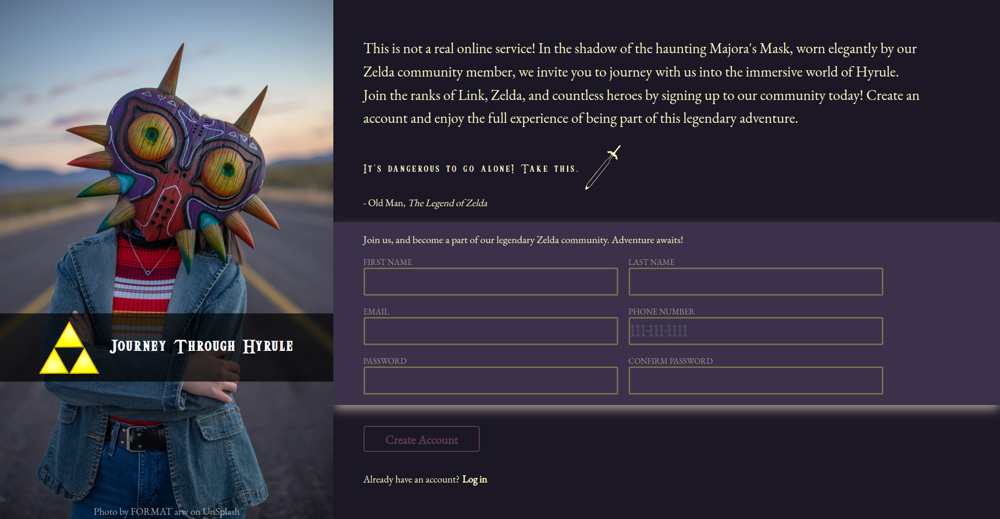

# :bow_and_arrow: Journey Through Hyrule - Sign Up Page :bow_and_arrow:

Welcome to the Journey Through Hyrule project! This is a simple sign-up page themed around The Legend of Zelda: Majora's Mask.

## Description

This project includes a responsive sign-up form styled with a custom CSS. It is designed with a Legend of Zelda theme in mind. It uses HTML5, CSS, and vanilla JavaScript. 

The form includes live password matching validation and custom error messages.

## Links
- [Try Sign-up Form here!](https://zman64.github.io/sign_up_form/)

- [Link to the Assignment](https://www.theodinproject.com/paths/full-stack-javascript/courses/intermediate-html-and-css/lessons/sign-up-form)

## Setup Instructions

To use this project, follow these steps:

1. Clone this repository to your local machine.
2. Navigate to the project directory.
3. Open the `index.html` file in your browser to view the project.

## Known Issues

There are currently no known issues. If you encounter a problem, please open an issue.

## Future Plans

- Improve form validation (e.g., add validation for email)
- Implement server-side validation

## Contributions

This project is currently not accepting contributions. 

## License

This project is licensed under MIT.

## About

This is a form that checks for:
  - any value for first and last name
  - a valid email address (example@example.com)
  - a 9 digit phone number
  - a password that includes at least 1 capitalized letter, at least 1 number, and being at least 8 characters
  - a password confirmation

## Contact

If you have any questions, please [contact me](mailto:zkahlig64@gmail.com).

## :pray: Credits

- **The Odin Project** for providing the project in their curriculum.
- Unsplash for the beautfiul images

